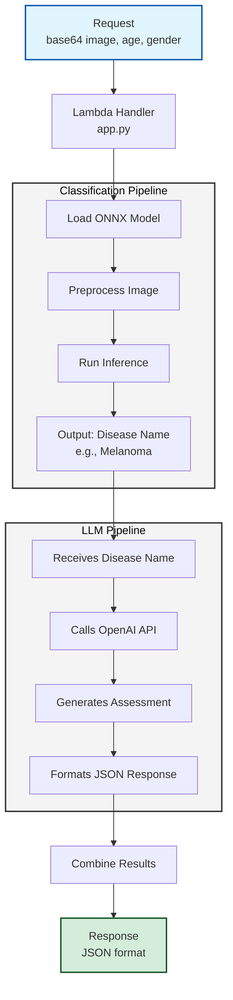

# START-Munich-4fun

Project SkinGuard was created during the START Hackathon at TUM on 29-30 November 2025. The challenge was organized by ONE WARE and was all about using the companie’s product OneAI for a specific real world use case (OneAI is a tool, allowing users to easily train powerful machine learning models for image classification purposes).

-----

## 📖 About this project

SkinGuard is a tool for medical screening purposes. The application’s aim is to give its users medical insights about skin irritations, which they usually could only get from a specialized dermatologist. It's core features a Python backend that trains a OneWare based image classification model. 
The application provides a clean interface for users to quickly analyse any skin irritations and get a fast first assessment.

## 📱 Screenshots

## 🚀 How it works

Users can upload a picture to the application (either by taking a new one with their camera or by uploading one from their gallery). Next, the application analyses the image for them, telling the user if the skin irritation in question is some kind of disease or not. In case of disease, the application classifies the disease, and gives the user some information about its severity, treatment suggestions (only suggesting treatments that require no prescription) and some general tips on how to ease the pain. Additionally, in case of disease, the user can book a doctor’s appointment directly through the application.

## ▶️ Get started

To get started on Android, you can install the app via this link: https://appdistribution.firebase.dev/i/e1f9099e228d478e

Here is a concise documentation snippet for your backend, ready to be pasted into your project's `README.md`.

***

## 🧠 Backend & AI Pipeline

The backend drives the core diagnostic logic, combining edge-optimized computer vision with medical-grade generative AI.

### **1. Vision Pipeline (`onnxruntime`)**
A custom image classification module built on One-Ware, which processes user photos to detect skin conditions.
* **Model:** Custom-trained `.onnx` model (`model_1_2025...`) running on CPU.
* **Preprocessing:** Accepts Base64 encoded images, resizes to target resolution, and normalizes pixel data (0-1 range).
* **Inference:** Uses `onnxruntime` for sub-second inference speed without GPU dependency.
* **Mapping:** Decodes prediction indices to human-readable labels via `classes.txt`.

### **2. Medical Intelligence (OpenAI API)**
A reasoning engine that translates the vision model's detection into actionable medical advice.
* **Model:** Powered by **GPT-5** with `reasoning_effort="low"` for fast, accurate triage.
* **Capabilities:** Uses the `web_search` tool to cross-reference diagnosis with up-to-date medical protocols.
* **Structured Output:** Enforces strict **JSON formatting** to ensure the Flutter frontend can render dynamic "Triage Cards" (Severity, Immediate Actions, Doctor Recommendations).

### **Setup & Environment**
* **Dependencies:** `onnxruntime`, `pillow`, `openai`, `pydantic`.
* **Configuration:** Requires an `.env` file with `OPENAI_API_KEY`.
* **Models:** Ensure `./models/` contains the latest `.onnx` file and `classes.txt`.

Here is the concise documentation for your deployment and infrastructure setup.

***

## ☁️ Deployment & Infrastructure

The project uses a serverless, container-based architecture hosted on AWS Lambda for high scalability and low maintenance.

### **1. Containerization (`Dockerfile`)**
We package the entire backend into a Docker image optimized for AWS Lambda.
* **Base Image:** Uses `public.ecr.aws/lambda/python:3.11` to ensure compatibility with the Lambda runtime environment.
* **Assets:** Copies the Python source code (`src/`), dependencies (`requirements.txt`), and the critical ONNX vision models (`models/`) into the container.
* **Handler:** Configures `app.lambda_handler` as the entry point to process incoming requests.

### **2. Automated Deployment (`deploy.sh`)**
A shell script that automates the CI/CD pipeline to update the live backend in seconds.
* **Build:** Compiles the Docker image specifically for `linux/amd64` (required for AWS Lambda compatibility), bypassing local architecture differences (e.g., Apple Silicon).
* **Push:** Tags and uploads the image to **Amazon ECR** (Elastic Container Registry).
* **Update:** Triggers `aws lambda update-function-code`, forcing the running function to pull the latest image immediately.

### **3. How AWS Connects Everything**
1.  **Flutter App:** Sends the user's image via HTTP POST to the exposed **Lambda Function URL**.
2.  **Amazon ECR:** securely hosts the backend Docker container.
3.  **AWS Lambda:** Pulls the container from ECR on-demand to spin up a serverless environment. It runs the ONNX inference locally (Vision) and calls the OpenAI API (Intelligence) before returning the JSON result to the phone.

### **4. Architecture**

## Disclaimer

SkinGuard does not substitute for a doctor’s visit. It was only created to test and demonstrate the power of ONE WARE and OneAI. SkinGuard serves as a helper to get a first opinion an skin irritation for educational purposes.
