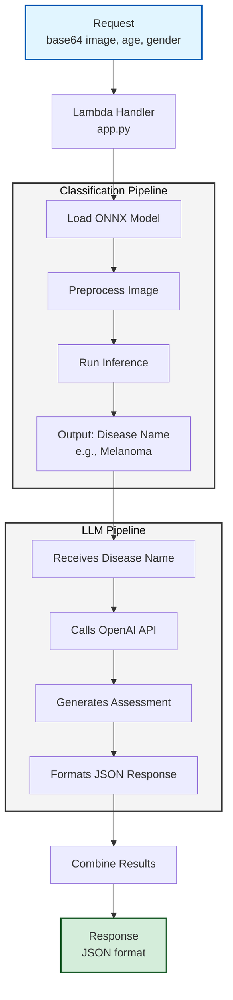

# Lambda Function - Skin Disease Classification

This AWS Lambda function provides skin disease classification and dermatological assessment. It combines an image classification with ONNX model and an assessment with OpenAI LLM to provide comprehensive analysis of skin conditions.

## Architecture



## Supported Disease Classes

The model can classify the following skin conditions:

1. Basal cell carcinoma
2. Benign lesions
3. Dermatitis
4. Eczema
5. Fungal infection
6. Melanocytic nevi
7. Melanoma
8. Psoriasis
9. Seborrheic keratoses
10. Viral infections

## Project Structure

```
lambda/
├── src/
│   ├── app.py                    # Lambda handler (main entry point)
│   ├── classification_pipeline.py # ONNX model inference
│   └── llm_pipeline.py           # OpenAI API integration
├── models/
│   ├── classes.txt               # Disease class labels
│   ├── model_1_2025-11-30_02-16-31.onnx
│   └── model2_2025-11-30_03-02-21.onnx
├── test/                         # Test images organized by class
├── evaluate_model.py             # Model evaluation script
├── Dockerfile                    # Container definition
├── deploy.sh                     # Deployment script
├── requirements.txt              # Python dependencies
└── README.md                     # This file
```

## Dependencies

- `onnxruntime` - ONNX model inference
- `numpy==1.26.4` - Numerical operations
- `Pillow` - Image processing
- `openai` - OpenAI API client
- `python-dotenv` - Environment variable management

## Setup

### Local Development

1. **Install dependencies**:
   ```bash
   pip install -r requirements.txt
   ```

2. **Set up environment variables**:
   Create a `.env` file in the lambda directory:
   ```
   OPENAI_API_KEY=your_openai_api_key_here
   ```

3. **Test locally**:
   ```bash
   python src/app.py
   ```

## API Usage

### Request Format

```json
{
  "image": "data:image/jpeg;base64,/9j/4AAQSkZJRg...",
  "age": 32,
  "gender": "male"
}
```

**Parameters:**
- `image` (required): Base64-encoded image string (with or without data URL prefix)
- `age` (optional): Patient age for assessment
- `gender` (optional): Patient gender for assessment

### Response Format

```json
{
  "statusCode": 200,
  "body": {
    "classification": {
      "disease_name": "Melanoma"
    },
    "llm_assessment": {
      "disease_description": "A brief description of the condition",
      "severity_level": "High",
      "immediate_action": "Seek immediate medical attention",
      "things_to_keep_in_mind": [
        "Monitor for changes",
        "Avoid sun exposure",
        "Keep the area clean"
      ],
      "consult_doctor": "Yes",
      "consult_doctor_reasoning": "High-risk condition requiring professional evaluation"
    }
  }
}
```

### Error Responses

**400 Bad Request** - Missing image:
```json
{
  "statusCode": 400,
  "body": {
    "error": "No image provided."
  }
}
```

**500 Internal Server Error**:
```json
{
  "statusCode": 500,
  "body": {
    "error": "Error message details"
  }
}
```

## Deployment

1. **Configure deployment settings**:
   Edit `deploy.sh` and update:
   - `REGION`: AWS region (default: `eu-central-1`)
   - `ACCOUNT_ID`: Your AWS account ID
   - `REPO_NAME`: ECR repository name (default: `skinguard`)
   - `FUNCTION_NAME`: Lambda function name (default: `skinguard-function`)

2. **Deploy**:
   ```bash
   chmod +x deploy.sh
   ./deploy.sh
   ```


